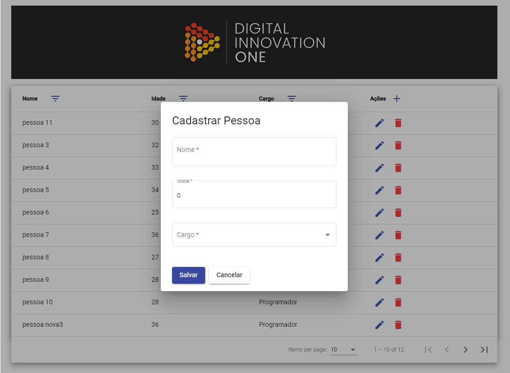

<h1 align="center">
:computer: Desenvolvendo SPA com Angular
</h1>

<h1 align="center">


<h2 align="center" style="color:black"> Projeto Concluído

<h2 align="center">

</h2>

<p align="center">
    <a href="https://www.linkedin.com/in/dev-full-stack/">
        
    </a>
</p>

<h5 align="center">
<p style="color:black">ÍNDICE</p>

[O desafio](#-O-desafio) | [Tecnologias utilizadas](#-Tecnologias-Utilizadas) | [Como baixar o projeto](#-Como-baixar-o-projeto)  | [Autor](#-Autor)

</h5>

## 🚀 O desafio

Desafio feito no Bootcamp da Digital Innovation One.
Nesse projeto foi criado uma Single Page Application com Angular, a missão foi criar uma página front-end utilizando componentes. 

## 🛠️ Tecnologias Utilizadas

- HTML5;
- CSS3;
- JavaScript;
- Angular;

## ⏬ Como baixar o projeto
- <b style="color:red"> OBS: </b> É necessário ter o git instalado em sua máquina
- Executar o Seguinte comando no seu **Terminal** ou no **CMD**:

```bash
        git clone https://github.com/armandofc1/angularSPACRUD.git
```
## ⌨️ Autor

<br>
<sub><b>Armando Costa</b></sub>

##### Contatos
[](https://www.linkedin.com/in/dev-full-stack/)
